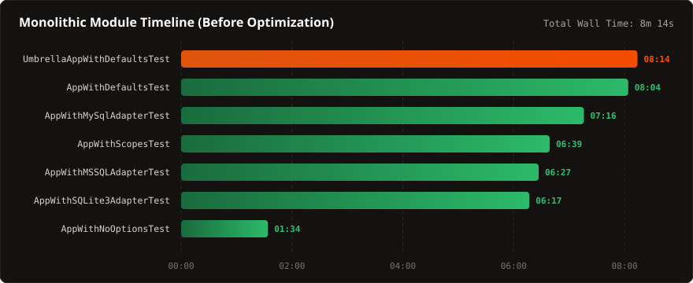
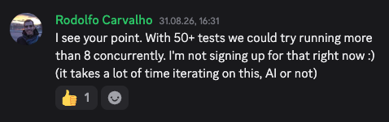
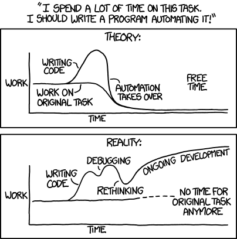
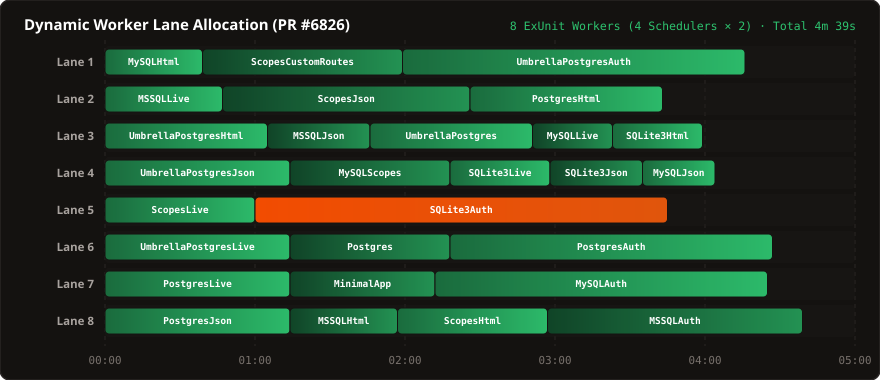

<!--
_class: lead
_paginate: skip
_header: ''
_footer: ''
-->
# Lessons from Optimizing<br>Phoenix Integration Tests


### From 10-Minute Black Box to 3-Minute Transparent CI

<div style="display: flex; justify-content: space-between; align-items: flex-start; max-width: 720px; width: 100%; margin: 36px auto 0 auto; padding-top: 20px; border-top: 1px solid var(--color-border); font-size: 0.8em; text-align: left;">
  <div>
    <div style="font-weight: 700; color: #ffffff; font-size: 1.1em;">Rodolfo Carvalho</div>
    <div style="margin-top: 5px;">
      <a href="https://www.praialabs.com/" target="_blank" rel="noopener noreferrer" style="color: var(--color-primary); font-weight: 500;">
        praialabs.com
      </a>
    </div>
  </div>
  <div style="text-align: right;">
    <div style="font-weight: 600; color: #f5f5f4;">Elixir Vienna Meetup</div>
    <div style="margin-top: 5px; color: var(--color-muted);">September 24, 2026</div>
  </div>
</div>

<!--
Speaker notes:
- Welcome everyone! Thank you for having me at Elixir Vienna.
- Tonight I want to share a hands-on, practical journey deep into the Phoenix Framework test infrastructure.
- If you've contributed to Phoenix or run large test suites in your own production apps, you know the pain of slow, opaque CI.
- We're going to see how we took Phoenix integration tests from 10 minutes down to ~3 minutes, and the hard-won lessons along the way.
-->

---

## About Me & Praia Labs

<div class="grid-2">
<div class="card">
  <h3><span class="badge">Background</span> Building with LiveView</h3>
  <ul>
    <li>Built and scaled <strong>SaaS product</strong> on Phoenix LiveView over the past few years.</li>
    <li>Now consulting through <strong>Praia Labs</strong>, helping teams design, build, and scale applications with Phoenix &amp; LiveView.</li>
    <li>Navigating AI-assisted development, mostly staying in the driver's seat.</li>
  </ul>
</div>

<div class="card">
  <h3><span class="badge badge-orange">Philosophy</span> Caring for Dependencies</h3>
  <ul>
    <li>Long-time contributor to <strong>Phoenix</strong>, <strong>LiveView</strong>, <strong>Hex</strong>, and the Elixir ecosystem.</li>
    <li><strong>Why work upstream?</strong>
      <ul>
        <li>A strong belief in giving back and actively <em>caring for our dependencies</em>.</li>
        <li>Investing in upstream speed and stability benefits every developer in the room.</li>
      </ul>
    </li>
  </ul>
</div>
</div>

<!--
Speaker notes:
- A quick 30 seconds on where I'm coming from:
- For the past few years, I built a SaaS product entirely on Phoenix LiveView.
- Recently, I launched Praia Labs, where I consult and help other engineering teams build, optimize, and scale production systems with Phoenix and LiveView.
- Throughout this journey, I've contributed upstream to Phoenix, LiveView, Hex, and other Elixir core tooling.
- I believe deeply in giving back and caring for our dependencies—when upstream tools are fast, transparent, and pleasant to work with, the entire ecosystem wins.
-->

---

<!--
_class: lead
_header: ''
-->
## Waiting for Long Builds


<p style="text-align: center; font-size: 0.75em; color: var(--color-muted); margin-top: 10px;">
  <em>"The #1 Programmer Excuse for Legitimately Slacking Off: My code's compiling."</em> (XKCD #303)
</p>

<!--
Speaker notes:
- A mandatory slide for any CI talk!
- 10 minutes is that awkward duration: too long to stare at the screen, too short to start working on a completely different deep feature.
- You lose context, check social media, grab coffee, and lose flow.
-->

---

## Context: Testing Phoenix Itself (Upstream)

<div class="grid-2">
<div class="card">
  <h3><span class="badge">Scope</span> Framework, Not an App</h3>
  <p>We are <strong>not</strong> talking about testing a typical app built with Phoenix.</p>
  <p>We are testing <strong>Phoenix itself</strong> (<code>phoenixframework/phoenix</code>):</p>
  <ul>
    <li>Testing code generation output end-to-end.</li>
    <li>Matrix across supported Elixir &amp; OTP versions.</li>
    <li>Compatibility with 4 database engines: PostgreSQL, MySQL, MSSQL, SQLite3.</li>
  </ul>
</div>

<div class="card">
  <h3><span class="badge badge-orange">Universal</span> Why This Matters to You</h3>
  <p>The lessons and wins apply to <strong>any project</strong>:</p>
  <ul>
    <li><strong>ExUnit concurrency model:</strong> How tests actually get scheduled across CPU cores.</li>
    <li><strong>Observability:</strong> Custom formatters &amp; CI step summaries.</li>
    <li><strong>Universal speedups:</strong> In-memory <code>tmpfs</code> RAM disks, caching tricks, and Docker ergonomics.</li>
  </ul>
</div>
</div>

<!--
Speaker notes:
- Important clarification right at the start!
- When people see "Phoenix testing", they usually assume it's about testing an app built with Phoenix (like testing controllers or LiveViews).
- This is about testing the framework itself upstream in the core Phoenix repository.
- Every release of Phoenix must guarantee that `mix phx.new` and all generators produce 100% valid, warning-free, perfectly formatted code that passes all tests across multiple Elixir, OTP, and database combinations.
- BUT: the techniques we'll cover—ExUnit scheduling, CI formatting, tmpfs, container caching—are universal and apply to every team in this room.
-->

---

## Phoenix Test Taxonomy: What Tests What?

The Phoenix repository contains **4 distinct test suites**:

- <span class="badge badge-orange">Unit & Core</span> **`/test`**:
  Unit & functional tests for framework internals (Router, Endpoint, Channels, PubSub).
- <span class="badge badge-purple">Installer</span> **`/installer/test`**:
  Validates `mix phx.new` scaffolding logic (does it generate expected files & trees?).
- <span class="badge badge-purple">Generators</span> **`/test/mix/tasks/`**:
  Validates `phx.gen.html`, `phx.gen.live`, `phx.gen.auth` code generation against mocked apps.
- <span class="badge">Integration</span> **`/integration_test`**:
  **The real deal.** Generates a complete app on disk, runs generators, compiles with `--warnings-as-errors`, verifies `mix format`, connects to real databases, migrates, and runs `mix test` inside the generated app!

<!--
Speaker notes:
- Important to establish this boundary up front.
- People often think installer tests are integration tests.
- But installer/test just checks if templates render without running them.
- /integration_test actually generates the whole application, boots live databases (Postgres, MySQL, MSSQL, SQLite), drops/creates databases, runs migrations, and invokes `mix test` inside the generated project.
-->

---

## The "Integration Test Tax" & The Black Box

* Every Phoenix PR carried an opaque **~10-minute CI tax**.
* **Worse than dots (`....`):**
  - CI runners buffer standard output line-by-line or by chunk.
  - Because ExUnit outputs progress dots without newlines, **dots didn't stream interactively!**
  - You literally stared at an empty spinning wheel for 8–10 minutes with zero feedback.
* **The Developer Anxiety:**
  - Did MSSQL hang on startup?
  - Is `mix deps.get` stalled on a network timeout?
  - Did compilation fail?
  - Nobody could tell until the whole job finished or timed out.

<!--
Speaker notes:
- As a long-time contributor, this was deeply personal. Every small PR meant waiting 10 minutes.
- The buffering detail is subtle but brutal: ExUnit prints single dots as tests pass. But GitHub Actions buffers output. So you don't even get dots!
- You just see a spinning circle with no lines emitted for nearly 10 minutes.
-->

---

## You Can't Optimize What You Can't Measure

### The Intuitive First Attempt: `mix test --slowest`
* ExUnit provides `--slowest N` and `--slowest-modules`.
* **The Profiling Trap:**
  - In ExUnit, passing `--slowest` automatically forces `--trace`!
  - `--trace` sets `--max-cases 1` (forcing all async tests to run **serially**) and sets `timeout: :infinity`!
  - Profiling destroyed the suite's concurrency and blew up wall-clock time!
* **Job-Level Opacity:**
  - Monolithic `test.sh` bundled system packages, DB boot, dependency fetch, compilation, and test execution into a single timed blob.

<!--
Speaker notes:
- The classic observer effect in performance debugging!
- You try to inspect what's slow using standard tooling (`--slowest`), but doing so changes the execution semantics from concurrent to serial.
- So the very act of profiling made the test run vastly slower.
-->

---

## Stage 1: Gaining Visibility ([PR #6825](https://github.com/phoenixframework/phoenix/pull/6825) & [PR #6817](https://github.com/phoenixframework/phoenix/pull/6817))

<div class="grid-2">
<div class="card">
  <h3>CI Step Decomposition (<a href="https://github.com/phoenixframework/phoenix/pull/6825">PR #6825</a>)</h3>
  <ul>
    <li>Replaced monolithic <code>test.sh</code> with discrete GitHub Actions workflow steps.</li>
    <li>Surfaced exact phase timings in the Actions UI:
      <ul>
        <li>Package install: ~15s</li>
        <li>DB healthcheck wait: ~20s</li>
        <li>Deps & NIF compile: ~45s</li>
        <li>Test execution: ~8m+</li>
      </ul>
    </li>
  </ul>
</div>

<div class="card">
  <h3>SummaryFormatter (<a href="https://github.com/phoenixframework/phoenix/pull/6817">PR #6817</a>)</h3>
  <ul>
    <li>Custom lightweight ExUnit formatter.</li>
    <li>Runs at <strong>full async concurrency</strong> (<code>max_cases: 8</code>).</li>
    <li>Preserves active timeout protection.</li>
    <li>Appends a structured Markdown duration table directly to <code>$GITHUB_STEP_SUMMARY</code>!</li>
  </ul>
</div>
</div>

<!--
Speaker notes:
- Now we can measure without destroying concurrency!
- PR 6825 broke down the shell script into distinct CI steps, so we could see how long each phase took.
- PR 6817 created SummaryFormatter, turning GitHub Step Summary into a rich observability dashboard.
- Now every PR showed exactly which test modules took the most time.
-->

---

## Baseline Timeline: The Monolith in Action

Timeline rendered by `SummaryFormatter` before splitting:



<p style="font-size: 0.72em; color: var(--color-muted); text-align: center; margin-top: 8px;">
  All 7 modules launch at 00:00. Fast modules finish early; 2 stragglers drag past 8 minutes.
</p>

<!--
Speaker notes:
- Look at this Mermaid chart—this was rendered directly into GITHUB_STEP_SUMMARY!
- You can immediately see the problem: 7 bars, all starting at 0, but UmbrellaAppWithDefaultsTest drags out to 8 minutes 14 seconds.
- After 6 minutes, almost everything else is done.
-->

---

## The Straggler Effect: vCPUs Idling

- Standard GitHub Actions Linux runners have **4 vCPUs** (16 GB RAM).
- **What happened during execution:**
  - $T = 0$: ExUnit starts all 7 modules (8 slots available).
  - $T = 1\text{m}30\text{s}$: Fast modules finish (`AppWithNoOptionsTest`).
  - $T = 7\text{m}00\text{s}$: Most modules finish.
  - **$T = 7\text{m}$ to $8\text{m}+$:**
    - **1~2 cores** still executing tests.
    - **Other vCPUs sit completely idle** doing nothing!
- The entire test suite wall-clock time was bounded by monolithic stragglers.

<!--
Speaker notes:
- With 4 vCPUs, BEAM has 4 schedulers, so ExUnit provides 8 parallel worker slots by default.
- But Phoenix only had 7 monolithic test files! Even at T=0, we couldn't saturate the runner.
- And once the quick files finished, one worker grinded away past 8 minutes while everything else sat completely idle.
- That idle tail is pure wasted wall-clock time.
-->

---

## Revelation #1: ExUnit's Scheduling Model

* How does ExUnit run asynchronous tests?
  - ExUnit parallelizes across **modules** (`async: true`).
  - BUT tests *within a single module* run **serially** on one process!
* Phoenix had only **7 monolithic test files**:
  1. `AppWithDefaultsTest` (12 tests)
  2. `UmbrellaAppWithDefaultsTest` (10 tests)
  3. `AppWithScopesTest` (8 tests)
  4. `AppWithMySqlAdapterTest` (6 tests)
  5. `AppWithMSSQLAdapterTest` (6 tests)
  6. `AppWithSQLite3AdapterTest` (6 tests)
  7. `AppWithNoOptionsTest` (5 tests)

<!--
Speaker notes:
- This is the single most important technical takeaway for anyone writing Elixir tests.
- When you write `use ExUnit.Case, async: true`, you might think all `test "..."` blocks run concurrently.
- No! ExUnit spawns one worker process per module. All tests inside that module run one after another in serial order.
- Parallelism only happens across different test files/modules.
-->

---

<!--
_class: lead
_header: ''
-->
## Famous Last Words...



<p style="text-align: center; font-size: 0.8em; color: var(--color-muted); margin-top: 18px;">
  <em>August 31: "I'm not signing up for that right now :)"</em><br>
  <strong>Spoiler:</strong> He went on to sign up for exactly that.
</p>

<!--
Speaker notes:
- This is a real quote from August 31st during early architecture discussions with Steffen.
- With 50+ tests, could we run more than 8 concurrently?
- My immediate, rational response: "I'm not signing up for that right now :) (it takes a lot of time iterating on this, AI or not)".
- It felt like too big of an undertaking with too many moving pieces.
- But as engineers... the temptation to fix the inefficiency never really leaves your mind.
- Which brings us directly to...
-->

---

<!--
_class: lead
_header: ''
-->
## "I'll Just Automate It!"



<p style="text-align: center; font-size: 0.75em; color: var(--color-muted); margin-top: 10px;">
  <em>"Theory: Work on original task permanently reduced. Reality: Rethinking, debugging, ongoing development..."</em> (XKCD #1319)
</p>

<!--
Speaker notes:
- Theory: "I'll just split those 7 files into smaller files, easy afternoon project!"
- Reality: Welcome to AST parsing, test matching, Elixir formatter limits, and database concurrency collisions!
-->

---

## Stage 2: Breaking the Monolith ([PR #6826](https://github.com/phoenixframework/phoenix/pull/6826))

* Split **7 monolithic files** into **33 focused async modules**:
  - `app_with_postgres_adapter_auth_html_test.exs`
  - `app_with_postgres_adapter_auth_live_test.exs`
  - `app_with_postgres_adapter_html_test.exs`
  - `app_with_postgres_adapter_json_test.exs`
  - `app_with_postgres_adapter_live_test.exs`
  - ...and symmetrical counterparts for MySQL, MSSQL, SQLite, & Umbrella!
* **Guarantees:**
  - Preserved all **53 original tests**.
  - Every module designed to execute in **under 3 minutes**.
  - ExUnit now dynamically saturates all runner cores from start to finish!

<!--
Speaker notes:
- This was PR #6826.
- Instead of grouping by database adapter and running 10 features serially, we split each feature permutation into its own module.
- Now, when a core finishes a test file, ExUnit immediately feeds it the next file from the queue of 33 modules.
- Zero worker starvation.
-->

---

## Trust but Verify: The AST Comparison Script

How do you refactor 53 critical tests across 33 files without missing assertions?

```elixir
defmodule CompareSuites do
  def run do
    main_tests = Enum.flat_map(git_files("upstream/main"), &parse_git_file/1)
    head_tests = Enum.flat_map(git_files("HEAD"), &parse_git_file/1)
    
    # 1. Parse AST with Code.string_to_quoted!/1
    # 2. Extract describe, test names, and tags
    # 3. Normalize app names: "pg_auth_live" -> "__APP__"
    # 4. Assert byte-for-byte / AST equivalence of every test body!
    match_and_diff_tests(main_tests, head_tests)
  end
end
```

<p style="font-size: 0.75em; color: var(--color-secondary);">
  ✅ Verified all 53 test bodies were 100% equivalent before opening the PR.
</p>

<!--
Speaker notes:
- With 53 tests in a foundational framework, manual review isn't enough.
- We built an Elixir script using `Code.string_to_quoted!/1` to parse the AST of upstream/main vs HEAD.
- It normalized the generated app names (replacing "pg_auth_live" with "__APP__") and verified that the test bodies were byte-for-byte identical.
- Fun anecdote: The AI assistant actually made subtle edits like expanding contractions ("it'd" -> "it would") in test names! So even with an AST matcher, there was still a human element of scrutiny and hope!
-->

---

## Greedy Interval Scheduling for Gantt Charts

- **Problem:** Rendering 33 individual rows in a Gantt chart produces an unreadable 33-line wall of text.
- **Solution in `SummaryFormatter`:**
  - Implemented **greedy interval scheduling** directly in Elixir!
  - Assigns non-overlapping test modules to compact virtual worker lanes (`Lane 1` to `Lane 8`).
  - Automatically tags the critical path module with `:crit`.

```elixir
defp assign_to_lane([], item, acc), do: Enum.reverse([[item] | acc])
defp assign_to_lane([[{_mod, %{finish: f}} | _] = lane | rest], {_m, %{start: s}} = item, acc) do
  if f <= s, do: Enum.reverse(acc) ++ [[item | lane] | rest],
  else: assign_to_lane(rest, item, [lane | acc])
end
```

<!--
Speaker notes:
- If you output 33 rows in Mermaid, the chart is gigantic and unreadable on GitHub.
- So we used a classic greedy interval scheduling algorithm: when a test finishes, place the next test that started after it into the same lane.
- This compresses the suite into 8 tidy lanes, matching ExUnit's 8 concurrent worker slots (4 schedulers × 2)!
-->

---

## Compact Gantt Timeline (Worker Lanes)



<p style="font-size: 0.7em; color: var(--color-muted); text-align: center; margin-top: 8px;">
  All 8 ExUnit worker slots stay saturated across 4 vCPUs. No worker sits idle waiting for a monolithic file.
</p>

<!--
Speaker notes:
- Look at the difference compared to the first chart!
- All 8 lanes are constantly working. When one module finishes, the next one immediately fills the slot.
- Total wall time dropped significantly because we eliminated the idle worker tail.
-->

---

## Infrastructure: Host Runners & tmpfs ([PR #6831](https://github.com/phoenixframework/phoenix/pull/6831))

* **Migrated from Alpine Container to Native Ubuntu Runner:**
  - Ran directly on `ubuntu-24.04` host using `erlef/setup-beam`.
  - Pre-installed system build tools (no more `apk add` latency).
  - Removed background `socat` TCP proxy bridges (ports bind directly to `localhost`).
* **Dependency & Build Caching:**
  - Enabled `actions/cache` for `deps/` and `_build/` keyed on `mix.lock`.
  - Saves **~50 seconds** of dependency re-compilation on warm runs!
* **Mounted `installer/tmp` on `tmpfs` (RAM Disk):**
  - Integration tests generate apps, copying dependencies & compiling code repeatedly.
  - Running file I/O entirely in RAM eliminated disk bottlenecks!

<!--
Speaker notes:
- Big infrastructure shift in PR #6831.
- Why run inside a nested Docker container when GitHub provides a powerful host runner?
- Running on the host unlocked actions/cache (saving ~50s on dependencies) and let us mount a 4GB tmpfs RAM disk for all temporary generated apps.
-->

---

## Sharding: `--test-partition` vs DB Sharding

Steffen Deusch and I explored two horizontal scaling strategies:

<div class="grid-2">
<div class="card">
  <h3>Generic Partitions (<a href="https://github.com/phoenixframework/phoenix/pull/6834">PR #6834</a>)</h3>
  <p><code>mix test --test-partition 4</code></p>
  <ul>
    <li>Great for self-contained unit tests!</li>
    <li><strong>The flaw for integration tests:</strong> ExUnit hashes test files across partitions.</li>
    <li>Every partition runner gets a random mix of Postgres, MySQL, & MSSQL tests.</li>
    <li><strong>Every runner must boot all 3 DBs!</strong></li>
  </ul>
</div>

<div class="card">
  <h3>Database Sharding (<a href="https://github.com/phoenixframework/phoenix/pull/6836">PR #6836</a>)</h3>
  <p><code>[postgresql]</code>, <code>[mysql]</code>, <code>[mssql]</code>, <code>[none]</code></p>
  <ul>
    <li>Shard strictly by backing database service.</li>
    <li>Containers boot <strong>on demand</strong>:
      <ul>
        <li><code>[sqlite3 + no-db]</code> boots <strong>0</strong> containers!</li>
        <li>Postgres runner boots <em>only</em> Postgres.</li>
      </ul>
    </li>
    <li>Mounts DB storage in <code>tmpfs</code>.</li>
    <li>Saturates 8 runners across 32 vCPUs!</li>
  </ul>
</div>
</div>

<!--
Speaker notes:
- This is a critical comparison.
- `mix test --test-partition` is a wonderful built-in feature in Elixir. Everyone should use it for standard unit tests!
- But when your tests have heavy external service dependencies, generic hashing forces every runner to start every database.
- Explicit database sharding meant sqlite3 starts instantly with zero Docker overhead, and each DB shard only runs the container it actually needs.
-->

---

## Cross-Shard Summary Aggregation

- **The Problem:** 8 parallel CI jobs = 8 separate GitHub Step Summaries.
  - Fragmented, cluttered, and hard to spot the overall critical path.
- **The Solution (`aggregate_summary.exs`):**
  1. Each shard writes a lightweight `summary.json` (a few KB).
  2. Uploaded as temporary workflow artifacts.
  3. A final aggregator job downloads the JSON files and compiles a unified dashboard:

| Elixir/OTP | Job | Status | Tests | Wall Time | Slowest Test |
| :--- | :--- | :---: | :---: | :---: | :--- |
| **1.20 / 29** | **Combined** | **Passed** | **53** | **`3m 19s`** | `UmbrellaPostgres`: auth live (`42s`) |
| | PostgreSQL | Passed | 24 | `3m 19s` | `UmbrellaPostgres`: auth live (`42s`) |
| | SQLite3 + no-DB | Passed | 14 | `2m 38s` | `UmbrellaDefaults`: defaults (`36s`) |
| | MySQL | Passed | 8 | `2m 04s` | `AppWithMySQL`: auth live (`38s`) |
| | MSSQL | Passed | 7 | `1m 32s` | `AppWithMSSQL`: auth html (`32s`) |

<!--
Speaker notes:
- With 8 shards, the GitHub Step Summary UI got messy.
- So we built an aggregation script: each job drops a JSON artifact, and a 10-second final step joins them all into a single, clean overview table.
- You can instantly see that PostgreSQL is the critical path at 3m19s.
-->

---

## The Payoff: 10 Minutes $\rightarrow$ 3m 35s!

Real CI wall-clock metrics from GitHub Actions Run [**33897992674**](https://github.com/phoenixframework/phoenix/actions/runs/33897992674/attempts/1#summary-101106087612):

<div class="grid-3" style="margin-bottom: 16px;">
  <div class="metric-box">
    <div class="metric-val">10m+</div>
    <div class="metric-lbl">ORIGINAL WALL TIME</div>
  </div>
  <div class="metric-box">
    <div class="metric-val" style="color: #22c55e;">3m 35s</div>
    <div class="metric-lbl">OPTIMIZED WALL TIME</div>
  </div>
  <div class="metric-box">
    <div class="metric-val" style="color: var(--color-phoenix);">~65%</div>
    <div class="metric-lbl">TOTAL TIME SAVED</div>
  </div>
</div>

* Breakdown:  
  `npm test`: 17s  
  `installer test`: 36s  
  `mix test`: 56s  
  `integration test [mssql]`: 1m 32s  
  `integration test [mysql]`: 2m 04s  
  `integration test [sqlite3 + no-db]`: 2m 38s  
  `integration test [postgresql]`: **3m 19s** <span style="color: var(--color-primary); font-weight: bold;">(Critical Path)</span>  
  `integration test results` (aggregator): 12s

<!--
Speaker notes:
- Here are the actual numbers from GitHub Actions!
- Total run started at 16:57:42 and finished at 17:01:17.
- Total wall-clock time: 3 minutes 35 seconds!
- PostgreSQL is the longest shard at 3m 19s, meaning that is our theoretical limit without splitting PostgreSQL further.
-->

---

## AI Pair Programming: Blessing & Curse

Using AI coding assistants (Gemini / Antigravity) throughout this journey:

<div class="grid-2">
<div class="card">
  <h3>The Blessing ⚡</h3>
  <ul>
    <li><strong>Rapid prototyping:</strong> Testing out interval scheduling algorithms in minutes.</li>
    <li><strong>AST parser generation:</strong> Generating the <code>CompareSuites</code> verification script.</li>
    <li><strong>Git archaeology:</strong> Tracing historical directory leaks back to 2014 commits.</li>
  </ul>
</div>

<div class="card">
  <h3>The Curse ⚠️</h3>
  <ul>
    <li><strong>Subtle bugs:</strong> Generated app names exceeded default 98-char formatter limits!</li>
    <li><strong>Phantom edits:</strong> Expanding/contracting words in test descriptions (<code>it'd</code> $\leftrightarrow$ <code>it would</code>).</li>
    <li><strong>Domain socket pitfalls:</strong> Container healthchecks probing Unix sockets instead of TCP.</li>
  </ul>
</div>
</div>

<p style="text-align: center; font-size: 0.8em; margin-top: 10px; color: var(--color-secondary);">
  <em>High speed requires even higher vigilance. "That's the times we live in."</em>
</p>

<!--
Speaker notes:
- Let's be honest about AI tools. Everyone in the room is either using them or curious about them.
- AI was incredible for generating the AST comparison script and interval scheduling logic in minutes.
- But it introduced subtle bugs: for example, naming an app "app_with_postgres_adapter_auth_live" made the generated router file exceed Elixir's default 98-character line length, causing `mix format` to fail!
- You must remain vigilant. Trust, but verify with automated tests.
-->

---

<!--
_class: lead
_header: ''
-->
## Software Testing Day


<p style="text-align: center; font-size: 0.75em; color: var(--color-muted); margin-top: 10px;">
  <em>"Celebrated every -1 years on January 0th at 25:71 PM."</em> (XKCD #2928)
</p>

<!--
Speaker notes:
- Comic 2928 from May 2024.
- Alt text: "The company tried to document how often employees were celebrating Software Testing Day, but their recordkeeping system kept mysteriously crashing."
- Edge cases are what we live for in testing.
-->

---

## Key Takeaways

1. **Measure Before Optimizing:**
   Beware of built-in flags that alter runtime semantics (like `mix test --slowest` forcing `--trace`).
2. **ExUnit Concurrency Model:**
   `async: true` parallelizes modules, not tests. Break up monolithic files to keep all CPU cores hot.
3. **Sharding with Services:**
   Generic test partitioning is great for unit tests; service-aware sharding is king when containers are involved.
4. **I/O Matters:**
   Mounting ephemeral test databases and temporary output on `tmpfs` is basically free speed.
5. **Observability as Code:**
   Custom ExUnit formatters and `$GITHUB_STEP_SUMMARY` can turn raw CI dots into transparent engineering dashboards.

<!--
Speaker notes:
- 5 practical rules you can take back to your own projects tomorrow morning.
- Especially #2 and #4: check your longest test files, split them up, and use tmpfs in CI.
-->

---

<!--
_class: lead
_paginate: skip
_header: ''
_footer: ''
-->
# Thank You! Questions?

<div style="display: inline-block; text-align: left; margin: 16px auto 0; font-size: 1.05em; line-height: 1.7;">
  <div><strong>Rodolfo Carvalho</strong></div>
  <div><a href="https://www.praialabs.com/">praialabs.com</a></div>
  <div>GitHub: <a href="https://github.com/rhcarvalho">@rhcarvalho</a></div>
</div>

<div style="max-width: 760px; margin: 36px auto 0; padding: 18px 28px; background: #1c1917; border-radius: 8px; border: 1px solid #292524; font-size: 0.82em; text-align: center; line-height: 1.5;">
  💜 Special thanks to <a href="https://github.com/SteffenDE"><strong>Steffen Deusch</strong></a> for maintaining Phoenix, exploring partition schemes, and reviewing PRs with patience and great insights!
</div>

<!--
Speaker notes:
- Thank you everyone for your time!
- A huge, heartfelt thank you to Steffen Deusch (@SteffenDE). He has been doing fantastic work maintaining Phoenix and spent hours exploring partition ideas with me and reviewing these PRs.
- Also thanks to Chris McCord, José Valim, and the whole Phoenix Core team for building and stewarding such an incredible framework.
- Happy to take any questions!
-->

---

<!-- header: Appendix -->

## Evolution from 2020 Scaffolding to 2024 Reality

<div class="grid-2">
<div class="card">
  <h3>The Origin (2020 - 2021)</h3>
  <ul>
    <li><strong>Late 2020:</strong> Aaron Renner introduces <code>/integration_test</code> (PRs <a href="https://github.com/phoenixframework/phoenix/pull/3970">#3970</a>, <a href="https://github.com/phoenixframework/phoenix/pull/4027">#4027</a>).</li>
    <li><strong>Jan 2021:</strong> Blog post celebrates <strong>Earthly</strong> for reproducible local & CI builds.</li>
    <li>Containerized build matrix with Docker Compose backing services.</li>
  </ul>
</div>

<div class="card">
  <h3>The Drift (2021 - 2024)</h3>
  <ul>
    <li><strong>May 2024:</strong> Earthly dropped by Steffen Deusch (<a href="https://github.com/phoenixframework/phoenix/pull/5817">PR #5817</a>) due to local developer friction.</li>
    <li>Replaced with simple <code>docker.sh</code> and Docker Compose.</li>
    <li><strong>Leftover CI debt:</strong> Tests still executed via a monolithic <code>test.sh</code> inside an Alpine Docker container.</li>
  </ul>
</div>
</div>

<!--
Speaker notes:
- Aaron Renner's 2021 blog post "Improving Testing & Continuous Integration in Phoenix" laid the groundwork.
- Earthly had a great promise: run CI builds locally with identical containers.
- But by 2024, it became a point of friction for contributors when things broke locally.
- When Earthly was removed in PR #5817, what was left in CI was a monolithic `test.sh` script running inside a nested Alpine container.
-->

---

## Local Workflow Ergonomics

CI improvements should **never** make local development painful!

- **Apple Silicon (`arm64`) Auto-Detection in `docker.sh`:**
  - Official Microsoft SQL Server image only supports `amd64`.
  - Detects architecture via `uname -m`; automatically skips MSSQL on ARM64 macs instead of crashing under emulation.
- **Warm Database Containers:**
  - `docker.sh` keeps database containers alive between runs.
  - Re-running tests has **zero container boot latency**!
  - Run `./docker.sh down` when you're done for the day.
- **Non-Root & Port Isolation:**
  - Container runs as non-root user (no root-owned file pollution).
  - Named volumes for native NIFs (`bcrypt`, `argon2`).
  - Database ports bind to loopback (`127.0.0.1`), preventing host port collisions.

<!--
Speaker notes:
- Don't optimize CI at the expense of local developers!
- On Apple Silicon, MSSQL crashes or crawls under Rosetta emulation. We detect ARM64 and cleanly skip MSSQL locally.
- Backing containers stay warm between test runs, so iterating locally is instantaneous.
-->

---

## Micro-Wins (AI-Induced Tangents)

<div class="grid-2">
<div class="card">
  <h3>Eliminating Blind Sleeps (<a href="https://github.com/phoenixframework/phoenix/pull/6830">PR #6830</a>)</h3>
  <ul>
    <li>Migration versions use 1-second timestamps (<code>YYYYMMDDHHMMSS</code>).</li>
    <li>Chained generators (<code>phx.gen.auth</code> then <code>phx.gen.live</code>) called <code>Process.sleep(1500)</code> 8 times to prevent collisions.</li>
    <li>Added <code>adjust_migration_timestamps/1</code>:
      <ul>
        <li>Backdates migrations on disk deterministically into the past.</li>
        <li>Subsequent generators create fresh timestamps instantly with <strong>zero sleep latency</strong>!</li>
      </ul>
    </li>
  </ul>
</div>

<div class="card">
  <h3>10-Year Directory Leak (<a href="https://github.com/phoenixframework/phoenix/pull/6833">PR #6833</a>)</h3>
  <ul>
    <li>Consolidated generated app output into <code>installer/tmp/</code>.</li>
    <li><strong>Git archaeology:</strong> Found that <code>with_installer_tmp/3</code> had been leaking empty random directories since <strong>2014</strong>!</li>
    <li>Fixed the directory leak, leaving clean disk space for in-memory tmpfs mounts.</li>
  </ul>
</div>
</div>

<!--
Speaker notes:
- Two nice hygiene PRs that cleaned up technical debt.
- The 1500ms sleep tax: 8 instances of sleeping 1.5 seconds. By backdating files on disk, we eliminated all sleeps entirely.
- And the directory leak: dating back to when phoenix.new was extracted in 2014/2015. Clean teardown enabled the next big optimization: tmpfs.
-->

---

## Upstream Pull Requests

- **[PR #6817](https://github.com/phoenixframework/phoenix/pull/6817)**: Add `SummaryFormatter` for integration test visibility in CI
- **[PR #6825](https://github.com/phoenixframework/phoenix/pull/6825)**: Decompose CI workflow steps & improve container reliability
- **[PR #6826](https://github.com/phoenixframework/phoenix/pull/6826)**: Split integration test suites into 33 async modules & lane scheduling
- **[PR #6830](https://github.com/phoenixframework/phoenix/pull/6830)**: Eliminate `Process.sleep` via backdated migration timestamps
- **[PR #6831](https://github.com/phoenixframework/phoenix/pull/6831)**: Run integration tests on host runner in CI with `actions/cache` & `tmpfs`
- **[PR #6833](https://github.com/phoenixframework/phoenix/pull/6833)**: Consolidate temporary app generation to `installer/tmp` and fix directory leak
- **[PR #6836](https://github.com/phoenixframework/phoenix/pull/6836)**: Shard integration tests by database with on-demand container setup in CI

<!--
Speaker notes:
- Annex slide for distribution and reference.
- All PRs are open or merged upstream at github.com/phoenixframework/phoenix.
-->
